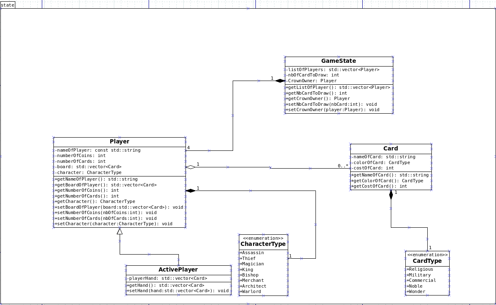

# Rapport de PLT
Exclusively in french
By [Karl Lubbos](https://github.com/KarlLbs), [Simon Tristant](https://github.com/Cinortas), [Nordine Laouedj](https://github.com/LNordine) et [Guillaume Champtoussel](https://github.com/GuillaumeChamptoussel).
## Présentation Générale

### Archétype
**Type de jeu:**
Citadelles est un jeu de plateau au tour par tour avec gestion de ressources. Il implémente aussi un aspect à identité secret.

**Nombre de joueurs:** 
Le jeu se joue de 2 à 7 joueurs. Les règles n'étant pas les même selon le nombre de joueur, nous fixons la taille de la partie à 4 joueurs.

**But du jeu:**
Le but du jeu est d'accumuler le plus de points de jeu en construisant des bâtiments dans sa cité. Le jeu s'arrête lorsqu'un des joueurs bâtit le 8e quartier de sa cité (on finit tout de même ce tour).

**Principe général:** 
Chaque joueur est à la tête d’une cité qu’il doit développer pour la rendre plus riche et plus prestigieuse. Les quartiers des cités sont représentés par des cartes. A chaque tour, le joueur incarne un personnage différent ayant son propre pouvoir, qui se révéle selon un ordre défini. A la fin du tour, tout le monde rend sa carte personnage puis on recommence.

### Ressources
**Les cartes personnages:**
Il existe 8 personnages ayant chacun un pouvoir et un ordre:

1-Assassin

2-Voleur

3-Magicien

4-Roi

5-Evêque

6-Marchand

7-Architecte

8-Condottière

**Les cartes quartier :**
Chaque quartier a une gemme de couleur qui indique sa catégorie (Religion = bleu, Noblesse = jaune, Commerce = vert, Militaire = rouge, Merveille = violet). Chaque quartier a un coût de construction égal au nombre de pièces d’or figurant en haut à gauche de la carte. Chaque quartier violet (appelé Merveille) a un effet sur le jeu, en faveur du joueur dans la cité duquel il est construit, qui est décrit sur la carte.

**Les pièces d'or:**
Il s'agit de la monnaie du jeu. Chaque joueur en reçoit 2 en début de partie. Il n'y a pas de limite de pièce d'or pouvant être possédé par un joueur, et la banque en possède une infinité.

**La couronne:**
Elle détermine quel joueur choisit en premier son personnage au début du tour.
### Règles du jeu
**Mise en place:**
Au début d'une partie, chaque joueur reçoit 2 pièces d'or, 4 cartes quartiers puis on attribut la couronne à un joueur aléatoirement choisi.

Une partie se décompose en tours ayant tous le même déroulement.

Déroulement d'un tour:

**I - Choix des personnages:**

Le joueur qui possède la couronne mélange les 8 cartes personnages. 3 cartes sont alors choisies aléatoirement puis écartées, 2 face visibles et 1 face cachée (le Roi ne peut pas se trouver dans les cartes face visible).
Le joueur choisit ensuite un personnage, puis il passe le paquet de cartes au joueur à sa gauche qui choisit à sont tour et ansi de suite pour les 4 joueurs. La dernière carte est donc également écartée à la fin du choix du 4ème joueur.

**II - Tours des joueurs:**

Les personnages sont appelés dans l'ordre de leur numéro. Chaque fois qu’un personnage est appelé, le joueur qui l’avait choisi révèle sa carte de personnage et joue son tour. Si aucun joueur n’avait choisi ce personnage, on appelle le personnage suivant.
Lorsque tous les joueurs ont joué, on reprend les huit cartes de personnages et on les mélange pour passer au tour suivant.
Les joueurs jouent donc à tour de rôle, non pas dans le sens horaire habituel mais dans un ordre qui dépend des cartes de personnages qu’ils ont choisies.

**Exemple:** 

Supposons que le joueur 1 à choisi le Voleur, le joueur 2 à choisi l'Architecte, le joueur 3 a choisi le Marchand et le joueur 4 a choisi le Roi.

Les personnages sont alors appelés selon leur ordre:

1-Assassin : personne ne joue

2-Voleur : Le joueur 1 joue son tour

3-Magicien: personne ne joue

4-Roi : le joueur 4 joue son tour

5-Eveque : personne ne joue

6-Marchand : le joueur 3 joue son tour

7-Architecte : le joueur 2 joue son tour

8-Condottière : personne ne joue  

‎ 

Lorsque le personnage d’un joueur est appelé, le joueur effectue les actions suivantes:

  1) Au choix: soit prendre deux pièces d'or de la banque; soit piocher deux cartes Quartier, en choisir une et se défausser de l’autre.
 
2) Il peut ensuite poser dans sa cité l’une de ses cartes Quartier en payant à la banque le coût indiqué sur la carte. Un joueur ne peut jamais avoir deux quartiers de même nom dans sa cité.
 
  3) Chacun des personnages dispose également d'un pouvoir spécial pouvant être utilisé lors de son tour de jeu. Tous les pouvoirs ne doivent pas être joué nécessairement au même moment du tour (précisé par la suite). 

Les pouvoirs des personnages :
  
**1-Assassin**

Vous annoncez quel autre personnage vous assassinez. Le joueur qui a ce personnage ne doit pas réagir, et ne se déclarera pas non plus lorsque son personnage sera appelé. Il ne révèlera sa carte qu’en dernier, pour annoncer qu’il avait été assassiné et qu’il a donc passé son tour.

**2-Voleur**

Vous annoncez quel autre personnage vous volez. Lorsque le joueur qui a ce personnage sera appelé et se révèlera, vous lui prendrez toutes ses pièces d’or. Le Voleur ne peut voler ni l’**Assassin**, ni le personnage assassiné.

**3-Magicien**

À n’importe quel moment de votre tour*, vous pouvez, au choix :
• soit échanger toutes les cartes de votre main contre toutes les cartes de la main d’un autre joueur.
• soit vous défausser d’un certain nombre de cartes de votre main et piocher le même nombre de cartes en échange.

**4-Roi**

Vous recevez une pièce d’or par quartier noble (jaune) dans votre cité*. Vous prenez immédiatement la carte Couronne. Au tour suivant, vous choisirez votre personnage en premier. Si aucun joueur n’a choisi le **Roi**, le **Roi** précédent conserve la couronne.
Si le **Roi** est assassiné, il passe son tour comme n’importe quel personnage. Néanmoins, après que tous les autres joueurs ont joué, lorsqu’il annonce qu’il était Roi et a été assassiné, il prend la carte couronne.

**5- Évêque**

Vous recevez une pièce d’or par quartier religieux (bleu) dans votre cité*. Vous ne pouvez pas être attaqué par le **Condottiere**.

**6-Marchand**

Vous recevez au début de votre tour une pièce d’or supplémentaire. Vous recevez une pièce d’or par quartier commerçant (vert) dans votre cité*.

**7-Architecte**

Au début de votre tour, vous piochez deux cartes Quartiers supplémentaires. Vous pouvez en outre bâtir jusqu’à trois quartiers durant votre tour.

**8-Condottiere**

Vous recevez une pièce d’or par quartier militaire (rouge) dans votre cité*. À la fin de votre tour, vous pouvez attaquer une cité pour y détruire un quartier de votre choix en payant le coût de ce quartier mooins un (ex: 1 pièce d’or pour un quartier en coûtant 2 à construire). Le **Condottiere** ne peut attaquer une cité déjà terminée, avec ses huit quartiers.

(* Ces actions peuvent être effectuées à n’importe quel moment du tour, au choix du joueur. Ainsi, un joueur peut prendre les revenus de ses quartiers avant de construire (s’il a besoin d’argent pour construire) ou après avoir construit (si le nouveau quartier lui rapporte). Tous les revenus des quartiers doivent cependant être perçus en une seule fois.

**III - Fin de partie et décompte final des points:**

Lorsqu’un joueur construit son huitième et dernier quartier, on termine le tour en cours et la partie est terminée. Chaque joueur compte ses points comme suit :
	
 1) Coût de construction total des quartiers de la cité
	
 2) +3 si la cité comprend des quartiers des cinq couleurs différentes
	
 3) +4 pour le premier joueur ayant posé son huitième quartier
	
 4) +2 pour les autres joueurs ayant huit quartiers
	
 5) Bonus lié à certaines merveilles

## Description et conception des états

### Description des états
Un état du jeu est formée par des éléments communs à tous les Players. Il est le même pour chaque joueur.
Un unique état est créer et tient toutes les données de la partie.

**2.1 Elements définissant les états**

Tous les Players ont accès à une pioche. Cette pioche est représentée par un nombre de cartes piochées. Le server se chargera de traiter cette information afin d'ajouter le nombre de cartes correspondant à la main du Player qui pioche.

Chaque joueur possède les éléments suivants.

- Un nom qui est cosmétique.
- Une playerId qui est unique et permet de différencier les joueurs au niveau de la partie.
- Un board qui est une liste de cartes représentant les bâtiments construits.
- Des pièces d'or.
- Le personnage qu'il incarne pendant ce tour, lui permettant certaines interactions.
- Une main qui correspond aux cartes en main.

Voici la liste des différents personnages que le joueur peut incarner à chaque tour :

- Assassin
- Thief
- Magician
- King
- Bishop
- Merchant
- Architect
- Warlord

Une carte est décrite par :

- Son nom
- Son coût (en pièce d'or)
- Sa couleur, voici la liste des couleurs :

	- Religious
	- Military
	- Commercial
	- Noble
	- Wonder

### Conception Logiciel

Le diagramme des classes pour les états est présenté en Figure 1, dont nous pouvons mettre en évidence.
les groupes de classes suivants :

**La classe GameState** : La classe GameState est la classe principale pour décrire l'état du jeu.  Elle est composé de toutes les données pertinentes accessible :
- Directement dans la classe.
- Via l'appel de méthodes sur les objets qui la compose.
Elle sert à regrouper tous les Players au sein d'une même classe afin de pouvoir y traiter les données propres et communes à chaque Players. 

**La classe Player** : Elle contient les données liés aux différents joueurs. C'est une classe générique pour représenter toutes les données auxquels tous les joueurs ont accès.

Nous avons utilisé les énumérations pour décrire les différents type de "GamePhase" (qui permet d'identifier les moments de la partie), "Character", "PlayerId" et de "couleur de bâtiments" car cela permet de rendre notre code plus lisible en donnant des noms significatifs aux valeurs possibles. Les énumérations limitent les valeurs possibles à celles que nous avons définies, offrant ainsi un meilleur contrôle sur les données que l'on manipule. Si on ajoute ou modifie un type de personnage ou une couleur de bâtiment, on devra simplement le faire dans l'énumération sans avoir à rechercher et à modifier chaque occurrence dans le code. 
Nous ajoutons aussi dans tous les énums une valeur par défaut qui sert pour les initialisations et neutralisations.

## Rendu: Stratégie et Conception

### Stratégie de rendu d'un état

### Conception logiciel

## Règles de changement d'états et moteur de jeu

### Règles

### Conception logiciel

## Intelligence Artificielle

### Stratégies

### Conception logiciel

## Modularisation

### Organisation des modules

### Conception logiciel
